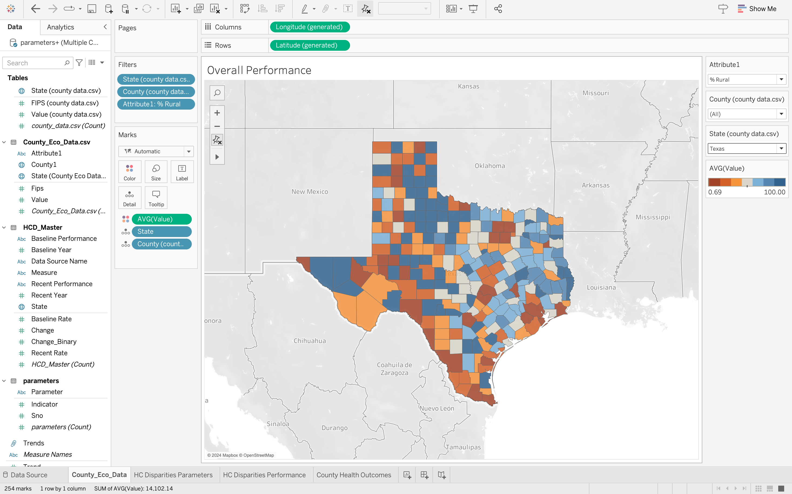

# Healthcare-Disparities
Exploring the differences and gaps in the quality of healthcare within the United States

## Introduction
The United States healthcare system is characterized by a blend of cutting-edge medical innovations and ongoing challenges surrounding access, affordability, and disparities in care. While advancements in treatments and technology are notable, a signification amount of the population still struggle with barriers to comprehensive healthcare coverage and rising costs. Our primary goal is to comprehensively analyze healthcare disparities at the state level in the U.S. We aim to utilize diverse datasets to identify and understand the factors contributing to these disparities, ultimately seeking pathways to address them effectively.

This research can potentially help get some insights on health disparities, identifying areas for improvement in healthcare access and equity, and guiding the development of targeted initiatives to address disparities and improve outcomes.

The datasets were downladed from the public server and consists of variety of information regarding population-specific differences in disease prevalence, health outcomes, and access to healthcare services and many more attributes, all at the state level.

## Steps followed

- [x] Downloaded open dataset from Kaggle, 
- [x] Data analysis to identify areas for cleaning
- [ ] Data cleansing
- [ ] Data Transformation
- [ ] Report building
- [ ] Testing & validation
- [ ] Report publising

## To do

- [ ] Publishing the report online at Tableau cloud
- [x] Code comment
